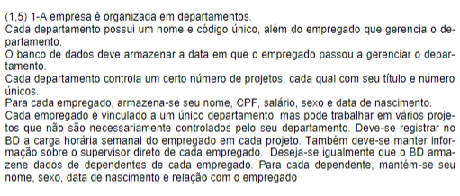
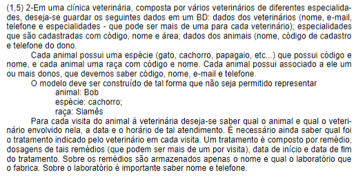

[[Journal/2023-08-14|2023-08-14]]
Ref: #ref/2023


___
# BD84-2023-08-11


## Lista
![[LISTA DE EXERCICIO BANCO DE DADOS- 3,0.pdf]]

### Questão 1



**Entidades e seus atributos**
```
* departamento
- id (pk)
- nome
- gerente (fk) -> Funcionario gerente

* funcionario
- cpf (pk)
- nome
- salario
- sexo
- data_nasc
- id_depar (fk) -> Departamento

* projeto
- id (pk)
- titulo
- id_depar (fk) -> Departamento

* func_rojeto
- func (fk)
- proj (fk)
- carga_sem 

* dependente_func
- cpf (pk)
- nome
- sexo
- data_nasc
- func_relac (fk)(cpf) -> Funcionario relacionado
- tipo_relac (fk) 

* tipo_relac
- id (pk)
- descricao
```

**Modelo lógico**


### Questão 2



**Entidades e atributos**
```
* veterinario  
- id_veterinario (pk)  
- nome  
- email  
- id_tel_vet  
  
* tel_vet  
- id  
- numero  
  
* especialidade  
- id_especialidade  
- nome  
- area  
  
* veteronario_especialidade  
- id_veterianario (fk)  
- id_especialidade (fk)  
  
* especie  
- id_especie  
- nome  
  
* raca  
- id_raca  
- nome  
- id_especie (fk)  
  
* pet  
- id_pet (pk)  
- nome  
- id_especie (fk)  
- id_raca (fk)  
  
* dono_pet  
- cpf (pk)  
- nome  
- email  
- telefone
  
* dono_pet_has_pet
- id_cliente (fk)  
- id_pet (fk)  
  
* visita  
- id_visita (pk)  
- id_pet (fk)  
- id_veterianario (fk)  
- data  
- horario  
  
* tratamento  
- id_tratamento (pk)  
- id_visita (fk)  
- id_remedio (fk)  
- dosagem  
- data_inicio  
- data_fim  
  
* remedio  
- id_remedio  
- nome  
- id_laboratorio (fk)  
  
* laboratorio  
- id_laboratorio (pk)  
- nome  
- telefone
```

**Modelo lógico**

