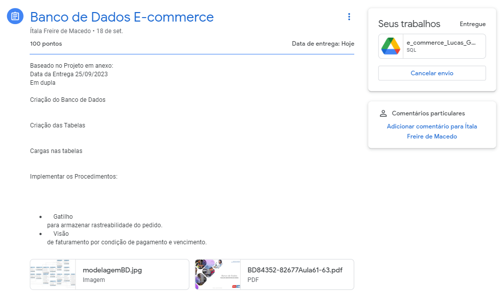

# Atividade de banco de dados 

Baseado no Projeto em anexo:
Data da Entrega 25/09/2023
Em dupla

- Criação do Banco de Dados
- Criação das Tabelas
- Cargas nas tabelas
- Implementar os Procedimentos:
    - Gatilho
    - para armazenar rastreabilidade do pedido.
    - Visão de faturamento por condição de pagamento e vencimento.

**Anexos:**
- [PDF](BD84352-82677Aula61-63.pdf)
- 

